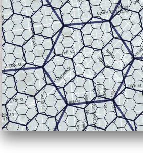
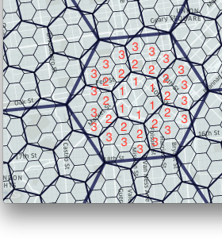
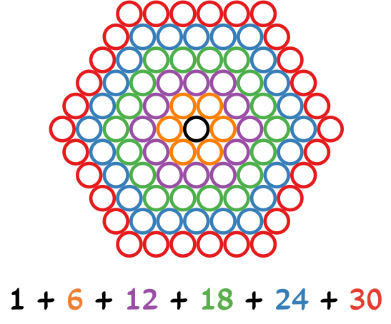
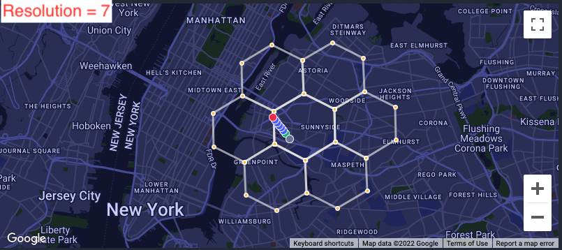
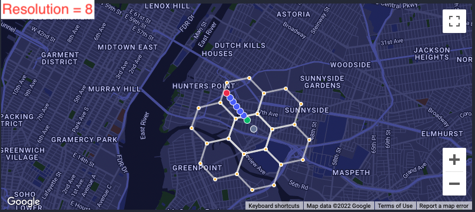
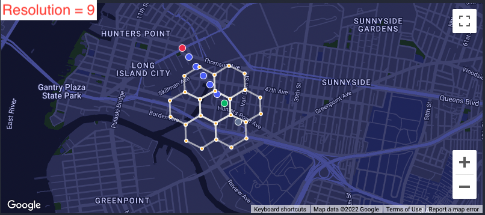
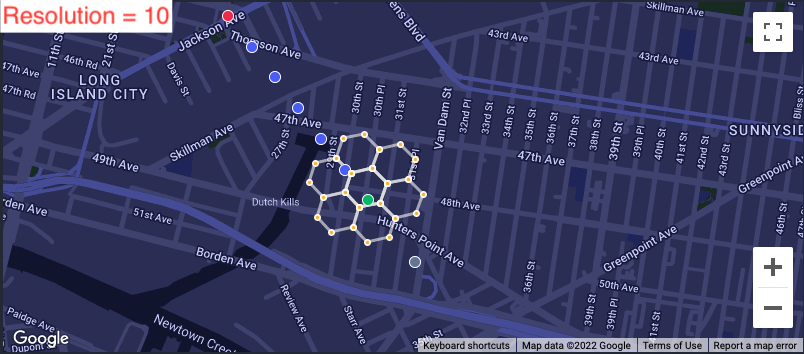

# H3
## Cells
The map is partitioned into hexagons.
This is done at multiple resolutions, where with each increasing resolution, a
hex cell occupies approximately 1/7th less surface area.

  
  

## k-Rings

A k-ring is any concentric ring around a cell.
The 1-ring is the ring of cells you can get to with one outward hop / traversal.
The 2-ring is the same, but for 2 hops. And so on.

  

For each location ingested, we use the H3 library to determine hex cells at
various resolutions, as well as the 1-ring and 2-ring at various resolutions.

## Resolutions
Lots of resolutions are [supported](https://h3geo.org/docs/core-library/restable):

| Resolution | Avg Hex Area               | Avg Hex Edge Length (km) | Number of unique indexes |
|------------|----------------------------|--------------------------|--------------------------|
| 5          | 252.9 km2       | 8.5 km                   | 2,016,842                |
| 6          | 36.13 km2       | 3.2 km                   | 14,117,882               |
| 7          | 5.16 km2        | 1.2 km                   | 98,825,162               |
| 8          | 737327.6 m2     | 461 m                    | 691,776,122              |
| 9          | 105332.5 m2     | 174 m                    | 4,842,432,842            |
| 10         | 15047.5 m2      | 65 m                     | 33,897,029,882           |
| 11         | 2149.6 m2       | 24 m                     | 237,279,209,162          |

Brooklyn is 250 km2 (one cell at Resolution 5)...

Williamsburg is 5 km2 (one cell at Resolution 7)...

  
  
  
  

